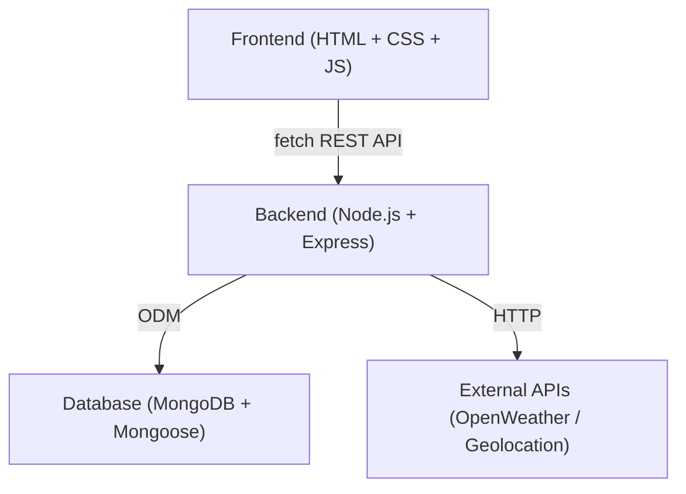

# Smart Water Conservation Platform — Implementation Plan

A full-stack web application that enables users to register water-consuming devices, monitor usage patterns, set conservation goals, and receive location-aware water-saving tips. Admins validate service providers and experts. Service providers can publish tips and reports.

> [!IMPORTANT]
> Frontend is built with **vanilla HTML, CSS, and JavaScript** — no frameworks. The backend serves a REST API consumed via `fetch()` calls from the frontend.

---

## System Architecture



---

## Tech Stack

| Layer | Technology | Reason |
|---|---|---|
| Frontend | HTML5 + CSS3 + Vanilla JS | No build step, full control, runs in any browser |
| Charts | Chart.js (CDN) | Lightweight canvas-based charts for usage data |
| Icons/Fonts | Font Awesome + Google Fonts | Clean modern look via CDN |
| Backend | Node.js + Express.js | Lightweight, well-supported REST API |
| Database | MongoDB + Mongoose | Flexible schema for device/usage data |
| Auth | JWT + bcryptjs | Stateless, role-based authentication |
| External API | OpenWeatherMap API | Location-based water-saving tips |
| Deployment | Render (backend) + GitHub Pages / Netlify (frontend) | Free tier, easy CI/CD |

---

## User Roles

| Role | Capabilities |
|---|---|
| **End User** | Register devices, monitor usage, set goals, view tips |
| **Service Provider / Expert** | Publish tips, submit reports (requires admin validation) |
| **Admin** | Validate providers/experts, manage users, view system stats |

---

## Project Structure

```
smart-water-platform/
├── backend/
│   ├── config/          # DB connection, env vars
│   ├── models/          # Mongoose schemas
│   ├── routes/          # Express route files
│   ├── controllers/     # Business logic
│   ├── middleware/      # Auth, role guards, error handler
│   └── server.js
├── frontend/
│   ├── index.html           # Landing page
│   ├── login.html           # Login page
│   ├── register.html        # Registration page
│   ├── dashboard.html       # User dashboard
│   ├── devices.html         # Device management
│   ├── usage.html           # Usage log & history
│   ├── goals.html           # Conservation goals
│   ├── tips.html            # Water-saving tips
│   ├── provider.html        # Provider portal
│   ├── admin.html           # Admin dashboard
│   ├── css/
│   │   ├── style.css        # Global styles, design system
│   │   └── dashboard.css    # Dashboard-specific styles
│   └── js/
│       ├── api.js           # fetch() wrappers for all API calls
│       ├── auth.js          # Token storage, login/logout helpers
│       ├── dashboard.js     # Dashboard page logic
│       ├── devices.js       # Device page logic
│       ├── usage.js         # Usage log + Chart.js charts
│       ├── goals.js         # Goals page logic
│       ├── tips.js          # Tips page logic
│       ├── admin.js         # Admin dashboard logic
│       └── router.js        # Client-side role-based redirect guard
└── README.md
```

---

## Core Modules

### 1. Authentication & Authorization
- Register/Login with JWT (**access token only**, stored in `localStorage`)
- Roles: [user](file:///C:/Users/ADARSH/Desktop/New%20folder/smart-water-platform/frontend/js/api.js#69-70), `provider`, `admin`
- Middleware: [protect](file:///C:/Users/ADARSH/Desktop/New%20folder/smart-water-platform/backend/middleware/auth.js#4-21) (auth check), [authorize(roles)](file:///C:/Users/ADARSH/Desktop/New%20folder/smart-water-platform/backend/middleware/auth.js#22-34) (role guard)

### 2. Device Management
- Users register devices (e.g., shower, irrigation, dishwasher)
- Device types: `shower | tap | irrigation | dishwasher | washing_machine | other`
- CRUD: add, edit, delete, list devices per user

### 3. Usage Tracking
- Log water usage per device (liters, timestamp, duration)
- Daily / weekly / monthly aggregation
- Compare against national/regional averages

### 4. Conservation Goals
- Users set a monthly target (e.g., reduce by 20%)
- System tracks progress as usage data comes in
- Alerts when approaching or exceeding goal

### 5. Water-Saving Tips
- Admin and providers publish tips
- Tips tagged by: category (shower, garden…), location, season
- Location-aware tip filtering via user's city/region
- "Daily Tip" feature on dashboard

### 6. Admin Dashboard
- View all pending provider/expert validation requests
- Approve / reject service providers
- View platform-wide statistics (total users, total water saved, active devices)
- Manage users (suspend, change role)

---

## Database Schema (MongoDB)

```
User          { name, email, password(hashed), role, location, isApproved, createdAt }
Device        { userId, name, type, brand, location, isActive, createdAt }
UsageLog      { userId, deviceId, liters, duration, recordedAt }
Goal          { userId, targetLiters, month, year, progress }
Tip           { authorId, title, body, category, location, season, isApproved, createdAt }
Notification  { userId, message, read, createdAt }
```

---

## REST API Endpoints

| Method | Endpoint | Role | Description |
|---|---|---|---|
| POST | `/api/auth/register` | Public | Register new user |
| POST | `/api/auth/login` | Public | Login, get JWT |
| GET | `/api/users/me` | User | Get profile |
| GET/POST | `/api/devices` | User | List / add device |
| PUT/DELETE | `/api/devices/:id` | User | Edit / delete device |
| POST | `/api/usage` | User | Log water usage |
| GET | `/api/usage/summary` | User | Get usage stats |
| GET/POST | `/api/goals` | User | Get / set goal |
| GET | `/api/tips` | User | Get filtered tips |
| POST | `/api/tips` | Provider | Submit tip |
| GET | `/api/admin/users` | Admin | List all users |
| PUT | `/api/admin/approve/:id` | Admin | Approve provider |
| GET | `/api/admin/stats` | Admin | Platform statistics |

---

## Frontend Pages

| HTML File | Role | Key JS File | Features |
|---|---|---|---|
| [index.html](file:///C:/Users/ADARSH/Desktop/New%20folder/smart-water-platform/frontend/index.html) | Public | — | Hero, features overview, CTA |
| [login.html](file:///C:/Users/ADARSH/Desktop/New%20folder/smart-water-platform/frontend/login.html) / [register.html](file:///C:/Users/ADARSH/Desktop/New%20folder/smart-water-platform/frontend/register.html) | Public | [auth.js](file:///C:/Users/ADARSH/Desktop/New%20folder/smart-water-platform/frontend/js/auth.js) | Forms, JWT storage in `localStorage` |
| [dashboard.html](file:///C:/Users/ADARSH/Desktop/New%20folder/smart-water-platform/frontend/dashboard.html) | User | [dashboard.js](file:///C:/Users/ADARSH/Desktop/New%20folder/smart-water-platform/frontend/js/dashboard.js) | Chart.js usage chart, device list, goal bar, daily tip |
| [devices.html](file:///C:/Users/ADARSH/Desktop/New%20folder/smart-water-platform/frontend/devices.html) | User | [devices.js](file:///C:/Users/ADARSH/Desktop/New%20folder/smart-water-platform/frontend/js/devices.js) | Add/edit/remove connected devices (dynamic DOM) |
| [usage.html](file:///C:/Users/ADARSH/Desktop/New%20folder/smart-water-platform/frontend/usage.html) | User | [usage.js](file:///C:/Users/ADARSH/Desktop/New%20folder/smart-water-platform/frontend/js/usage.js) | Log usage form, Chart.js bar chart, history table |
| [goals.html](file:///C:/Users/ADARSH/Desktop/New%20folder/smart-water-platform/frontend/goals.html) | User | [goals.js](file:///C:/Users/ADARSH/Desktop/New%20folder/smart-water-platform/frontend/js/goals.js) | Set goal, animated progress ring |
| [tips.html](file:///C:/Users/ADARSH/Desktop/New%20folder/smart-water-platform/frontend/tips.html) | All | [tips.js](file:///C:/Users/ADARSH/Desktop/New%20folder/smart-water-platform/frontend/js/tips.js) | Browse/filter tips by category or location |
| [provider.html](file:///C:/Users/ADARSH/Desktop/New%20folder/smart-water-platform/frontend/provider.html) | Provider | [tips.js](file:///C:/Users/ADARSH/Desktop/New%20folder/smart-water-platform/frontend/js/tips.js) | Submit tips, view approval status |
| [admin.html](file:///C:/Users/ADARSH/Desktop/New%20folder/smart-water-platform/frontend/admin.html) | Admin | [admin.js](file:///C:/Users/ADARSH/Desktop/New%20folder/smart-water-platform/frontend/js/admin.js) | Approve providers, platform stats cards |

---

## Verification Plan

### Backend API Tests (Manual with REST Client / Postman)
1. Register user → `POST /api/auth/register` → expect `201` + token
2. Login → `POST /api/auth/login` → expect `200` + JWT
3. Add device (authenticated) → `POST /api/devices` → expect `201`
4. Log usage → `POST /api/usage` → expect `201`
5. Get summary → `GET /api/usage/summary` → expect aggregated data
6. Set goal → `POST /api/goals` → expect `201`
7. Approve provider → `PUT /api/admin/approve/:id` (admin token) → expect `200`
8. Access admin route with user token → expect `403 Forbidden`

### Frontend Manual Walkthrough
1. Open [frontend/index.html](file:///C:/Users/ADARSH/Desktop/New%20folder/smart-water-platform/frontend/index.html) in a browser (backend served from `localhost:5000`)
2. Register as End User → verify JWT stored in `localStorage`, redirected to [dashboard.html](file:///C:/Users/ADARSH/Desktop/New%20folder/smart-water-platform/frontend/dashboard.html)
3. Add 2 devices → verify they appear in device list (DOM updated dynamically)
4. Log usage for each device → verify Chart.js bar chart updates
5. Set a conservation goal → verify animated progress ring
6. Browse [tips.html](file:///C:/Users/ADARSH/Desktop/New%20folder/smart-water-platform/frontend/tips.html) → verify location filter works
7. Register as Provider → verify "pending approval" banner
8. Login as Admin → open [admin.html](file:///C:/Users/ADARSH/Desktop/New%20folder/smart-water-platform/frontend/admin.html) → approve provider → verify provider sees publish form

### Automated Tests (Supertest — to be added)
- Unit tests for auth middleware (role guards)
- Integration test for usage aggregation logic
